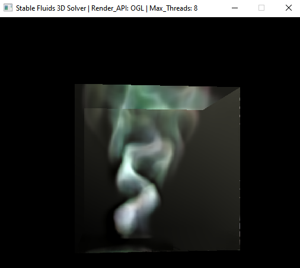

# Stable Fluids 3D - Fluid Solver - Work In Progress !



This is a 3D Implementation of Jos Stams famous paper [Stable Fluids](https://d2f99xq7vri1nk.cloudfront.net/legacy_app_files/pdf/ns.pdf "Paper") on the CPU.
Implemented in C++ in an OOP Framework style, with OpenGL currently the only implemented Graphics API, For Ray Marching the resulting 3D Density Grid. 
However the `renderobject_3D` abstract base Class can be implemented to support other API Backends. This Multi-Render Handler abstraction will be futher increased later.  

The Advection Method implemented currently uses Semi-Lagrangian (Single Step, Forward Euler), with ethier Linear or Cosine Interoplation. 
The Pressure Projection step uses a Matrix-less implementation of the Gauss-Seidel (Single-Threaded) with Sucessive Over Relaxation or Jacobi (Multi-Threaded) 
iteeative linear solvers to compute the pressure grid. While the Jacobi method can be safley Multi-Threaded increasing performance, its simultaneous displacements
result in much slower convergence than the Gauss-Seidel method, espeically when using Sucessive Over Relaxation which increases convergence simmilar to the
Conjugate Gradient Method with sucessive displacements been applied within each solve iteration, thus its favoured as the default pressure solver.

*The Second Order accurate Runge Kutta 2 (MidPoint) Method is currently implemented but not enabled in solver just yet.  
*SSE and AVX Intrinsics are been implemented to speed up Linear Interoplations aswell as Graident Caluclations. 

I Chose to implement my own templated vector and matrix classes oppose to using GLM. These are been futher refined. The Project as a whole has a long way to go.
For now no GUI is implemented, there are basic Inputs W/S for Camera Translation and Page Up/Down for Emission Source Scaling. The Mouse can be used
to re-postion the single point light illuminating the scene. 
The Application/Solve and Render Loop is currently embedded as part of the `fluidsolver_3` class itself, within the `fluidsolver_3::solve_step()` member function.

## Depenedancies ##
* GLFW - OpenGL Window and Context Creation.
* GLEW - OpenGL Extensions Loading/Wangiling.
* OpenMP 2.0 - Data Parallism Multithreading. 

## Building ##
CMake Build System is planned, for now relies on Visual Studio 2017+ (vc141). Libaries of GLFW and GLEW are statically Linked to the application as of now. 
Tested on Windows 7 and Windows 10. Linux Support coming soon. 

## Use Case - Setup Example ##
````C++
	// Create Render Context instance, to handle Graphics API Context and Window Creation -
	render_context_OGL render_c (win_size_xy, win_size_xy, short(GLMajor), short(GLMinor)); 

	// Create Fluid Object, Containing Fluid Grids and Data - 
	fluidobj_3d test_fluidobj (gridres_x, gridres_y, gridres_z, edge_size); 

	// Create FluidSolver Instance,  Pass FluidObj Pointer to It - 
	fluidsolver_3 test_fluidsolver (&test_fluidobj, timestep);

	// Pre Solve Parmaters Inital Values Set -
	test_fluidsolver.Parms.p_Do_Dens_Diff = false; 
	test_fluidsolver.Parms.p_Do_Dens_Disp = true;  
	test_fluidsolver.Parms.p_ProjectionType = test_fluidsolver.Parms.Project_GaussSeidel_SOR; 
	test_fluidsolver.Parms.p_SOR_alpha = 1.9f;
	test_fluidsolver.Parms.p_GS_Proj_iter = 5; 
	test_fluidsolver.Parms.p_AdvectionType = test_fluidsolver.Parms.Advect_SL_BackTrace_Euler;

	// Pass RenderContext Window -
	test_fluidsolver.set_window(render_c.get_window());

	// Call FluidSolver Solve_Step Member Function to begin Simulation and Rendering - 
	test_fluidsolver.solve_step(true, solve_steps);
````
